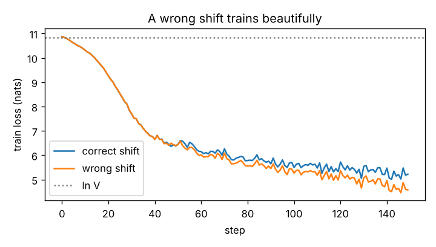
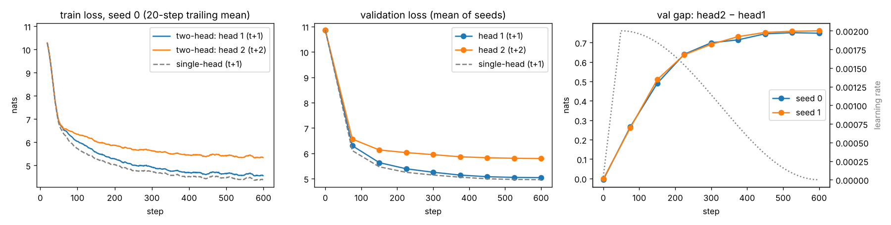

# LM loss harness — next-token loss, made correct and observable

**Notebook:** [`lm_loss_harness.ipynb`](lm_loss_harness.ipynb). It runs top to bottom on Colab with no manual steps.
Use a GPU runtime (a few minutes). On CPU only it takes about 1.5–2 hours.

**Setup.** A tiny decoder-only transformer (d_model 128, 4 layers, 4 heads, context 128, tied output head), trained on
TinyShakespeare with the GPT-2 BPE tokenizer (**V = 50,257**). Each speech is one document ending in `<|endoftext|>`,
split 90/10 by speech. AdamW, batch 16 × 128, 600 steps. Single-head and two-head models are each trained with
seeds 0 and 1. The numbers below come from the committed run (CPU). A GPU run reproduces items 1–3, 5 and 6 exactly;
the others move slightly. Design choices and their reasons are in [`DESIGN_NOTES.md`](DESIGN_NOTES.md).

The original snippet's shift was already the right way round (`logits[:, :-1]` vs `tokens[:, 1:]`). To make it
correct and observable, the targets are now built explicitly, masks are applied with `ignore_index`, the softmax runs
in fp32, and every step is printed as strings and checked against the raw corpus.

## Part 1 — the seven numbers

| # | Check | Result |
|---|---|---|
| 1 | **Shapes** | `tokens (4, 128)` batch × position · `hidden (4, 128, 128)` batch × position × d_model · `logits (4, 128, 50257)` batch × position × vocab · `logits[:, :-1] (4, 127, 50257)` last position has no target · `tokens[:, 1:] (4, 127)` target of each prediction · flattened `(508, 50257)` vs `(508,)` · `loss ()` |
| 2 | **Shift, as strings** | Inputs printed beside targets (`' thou' → ' d'`, `' d' → 'arest'`, `'.' → '<\|endoftext\|>'` …). Checked against the corpus offsets each window was cut from: **0 mismatches / 508**. |
| 3 | **Padding mask** | Contributing tokens **88 → 44**. Loss 10.695 → 10.801. |
| 4 | **Two documents packed, boundary masked** | Loss **5.220 → 5.212** over 94 → 93 targets. The single cross-document target costs 5.98 nats; the others average 5.21. Over 64 packed sequences (244 seams): **4.820 → 4.762**. |
| 5 | **Untrained perplexity** | **52,518** vs V = 50,257 (ratio 1.045). |
| 6 | **Tied vs untied head** | Tied **7,242,624** · untied **13,675,520** · difference 6,432,896 = exactly one V × d matrix (untied is 1.89×). |
| 7 | **Peak memory, forward + backward** (2,048 tokens) | Ordinary CE **1,179.6 MiB** · chunked CE (256-row chunks) **102.2 MiB** · ratio **11.5×**. |

**2 — the warning, demonstrated.** A model trained with the shift reversed reaches a *lower* training loss than the
correct one after 150 steps (4.66 vs 5.21 nats). Nothing errors, and the curve looks great. But scored with the
correct harness it gets 8.81 nats (perplexity 6,730, against about 240 for the correct model at the same step). The
printed strings show why: its top prediction is the token it has *already seen* one position earlier.

**3.** Masking makes the untrained loss go *up*. The padding targets are mostly `<|endoftext|>` → `<|endoftext|>`,
and with a tied head the model starts with a slight bias toward repeating its input. So those targets are cheaper
(10.59 vs 10.80 nats) and pulled the unmasked average down.

**4 — explained.** Targets were split into three kinds:

| Target kind | Mean loss (nats) |
|---|---|
| Ordinary, inside a document | 4.89 |
| End of document (`<\|endoftext\|>` as the target) | 0.64 |
| Seam: first token of the next document | 6.69 |

* The seam target is the start of the next speaker's name. An unrelated previous speech can't predict it, so it is
  pure noise in the loss, and in training it would teach a spurious "speech A → speaker B" link.
* Masking removes exactly one target per seam and keeps the end-of-document target, which is legitimate.
* The drop equals (244 / 8,128) × (6.69 − 4.76) = 0.058. That is an identity that gives its size, not separate evidence.
* Isolating attention per document (with position ids reset, so B is computed exactly as if it were alone) is a separate
  change. Here it gives 4.769, slightly worse. This model was trained with attention across boundaries, and all the
  validation speeches come from just two plays, so even a shuffled neighbour is mildly informative.

**5.** The loss at initialisation is ln V plus a little. Each logit has variance 0.0512, which equals d · 0.02² exactly.
For random logits that predicts a perplexity of V · e^{σ²/2} = 1.026 V. The observed 1.045 V is a little higher,
because the tied head links each logit to the input token. An assert stops the notebook if the ratio leaves 0.8–1.5.

**7.** A custom `autograd.Function` never stores the 2,048 × 50,257 logits. It saves one log-sum-exp per row and
recomputes chunks of logits in backward.
* Ordinary CE peaks at three logits-sized fp32 tensors (3 × 393 MiB).
* The ratio depends on chunk size: **64 rows → 65.0 MiB (18.1×)**, 256 → 102.2 MiB (11.5×), 1,024 → 396.0 MiB (3.0×).
* The chunked loss matches `F.cross_entropy` exactly in float64, passes `gradcheck`, and works with bf16 hidden states under autocast.
* On CPU the peak is measured from the process's peak resident memory; on GPU, with `torch.cuda.max_memory_allocated`.

## Part 2 — a second head predicting `t+2`

Head 2 is a small residual MLP feeding the same tied unembedding, so it adds only 131,968 parameters. Its targets
are `tokens[:, 2:]` scored from `logits2[:, :-2]`, printed as strings next to head 1's. The training loss is head 1 + head 2.

| Validation loss at step 600 | Seed 0 | Seed 1 | Mean |
|---|---|---|---|
| Head 1 (`t+1`) | 5.028 | 5.048 | **5.038** |
| Head 2 (`t+2`) | 5.777 | 5.808 | **5.792** |
| Sum | 10.805 | 10.856 | **10.830** |
| Single-head model, same setup (`t+1`) | 4.957 | 4.956 | 4.957 |

**What happens.** Both heads start at ln V and fall together during warm-up. Then they separate:

| Step | 75 | 150 | 300 | 450 | 600 |
|---|---|---|---|---|---|
| Gap, head 2 − head 1 (nats) | 0.26 | 0.50 | 0.70 | 0.75 | 0.75 |

The gap stops growing at step 450, and both seeds agree to within 0.02. From step 150 to 600, head 1 improves by
0.59 nats and head 2 by only 0.34.

**Why.** Head 2 has to predict t+2 without knowing t+1, so it also pays for its uncertainty about t+1. Formally, for a
stationary source, H(t+2 | ≤t) ≥ H(t+2 | ≤t+1) = H(t+1 | ≤t). Head 2's best possible loss is at least head 1's,
and strictly higher whenever t+1 carries information about t+2, as it does in text. Most of the easy structure in
BPE text (finishing split words, punctuation, the newline after a speaker's name) is about the very next token,
and only head 1 can use it.

This run can't tell how much of the gap's *size* comes from head 2's smaller capacity, and the flattening coincides
with the learning rate decaying to zero.

**Cost.** The extra head makes next-token loss **0.07–0.09 nats worse** than the single-head model, against a
seed-to-seed spread of 0.0007. This matches Gloeckle et al. (2024), where extra future-token heads hurt small models and
help only at large scale. One caveat: the summed loss is gradient-clipped far more often (99% vs 1% of late steps). With
Adam a steady rescaling mostly cancels, but this was not tested.

## Files

| File | What it is |
|---|---|
| `lm_loss_harness.ipynb` | The notebook, with outputs from the run above |
| `part2_losses.png`, `wrong_shift.png` | Plots saved by the notebook |
| `DESIGN_NOTES.md` | Setup, every design choice and why, likely questions with answers |
| `CHANGES.md` | What changed after an independent review, and why |

The notebook writes `chunked_ce.py`, `mem_probe.py` and `summary.json` itself while it runs. They don't need to be committed.
